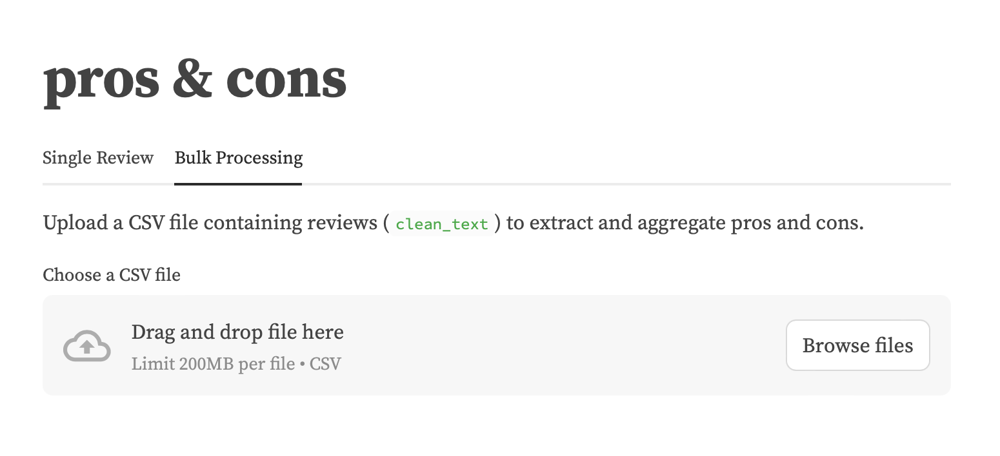

# MIPT Fine-Tuning RuGPT 3 for Review Analysis and Generation

## Overview
This project focuses on leveraging **RuGPT-3** to generate text reviews / extract strengths and weaknesses of establishments for various establishments based on specific input parameters like category, average rating, and keywords.

---

## Prototype

Experience the capabilities of our model through the live demo:

[Demo Stand](http://13.228.23.187:8502)


---

## Project Structure

```
├── data
│   ├── balanced.csv          # Cleaned and balanced dataset
│   ├── synthetic.csv         # Synthetic dataset
│   ├── test.csv              # Testing dataset
├── notebooks
│   ├── eda.ipynb             # Notebook for exploratory data analysis
│   ├── synthetic.ipynb       # Synthetic data generation process
├── streamlit
│   ├── app.py                # Streamlit UI for model interaction
│   ├── requirements.txt      # Required dependencies for Streamlit
├── model_gpt.ipynb           # Training notebook for the generation model
├── model_t5.ipynb            # Training notebook for the extraction model
├── README.md                 # Project documentation
```

---

## Data Sources

- **Geo Reviews Dataset 2023:**
  - [GitHub](https://github.com/yandex/geo-reviews-dataset-2023)
  - [HuggingFace](https://huggingface.co/datasets/d0rj/geo-reviews-dataset-2023/tree/main)

---

## Data Processing
The **eda.ipynb** notebook details:

**Data Cleaning:**
   - Removed emojis and special characters.
   - Standardized text formats.
   - Applied under-sampling techniques using `RandomUnderSampler` to balance class distributions.
   - Visualized frequent terms using word clouds.

---

## Model Training

### 1. **Review Generation Model**
 - TBA

### 2. **Aspect Extraction Model**

 - This [model](https://drive.google.com/file/d/1USDfb9qCaYulWvxBg09oc1p2ODziG-tK/view?usp=sharing) focuses on identifying key aspects (e.g., pros and cons) mentioned in the review. By learning patterns in the data, it extracts and categorizes these aspects, making it easier to understand the strengths and weaknesses presented in the reviews.

ROUGE scores:

 

---

## Deployment

- The models and UI are hosted via **Streamlit**.

---

## Team

- **Eduard Antonov**: Data preparation and cleaning, synthetic data generation
- **Roman Penzov**: Production
- **Konstantin Gridnev**: Model training
- **Alena Dragunskaya**: Analyst / Project Manager
- **Yacub Kharabet**: Model training